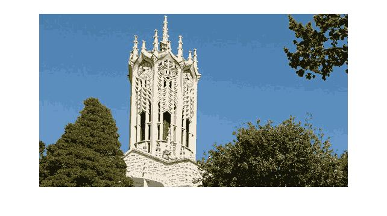

# K-Colour Image Processor | MATLAB | 
### ENGGEN 131 Assignment

This project aims to recreate k-colour images (where k is a
value specified by the user) from any arbitrary image containing many colours. The program uses the [k-means clustering algorithm](https://en.wikipedia.org/wiki/K-means_clustering) to group the pixel colours used in the
image into clusters. By determining the appropriate colours to use by taking the mean RGB
values of each cluster, the program produces a reduced colour image as accurate a representation of the
original colour image as possible. 

**Before**

**After**

## Executing the Program
Include the desired image to be reduced in the unzipped folder.

Open up "ConvertImage.m" and run in MATLAB.
The program will prompt you for the following inputs: 
1. "Please enter the name of the image you which to convert"
2. "How many colours do you want to use? (enter a small number)"
3. "What is the maximum number of iterations you want to permit? (e.g. 200):"

Upon entering the three parameters, the program will execute and output the reduced image.
